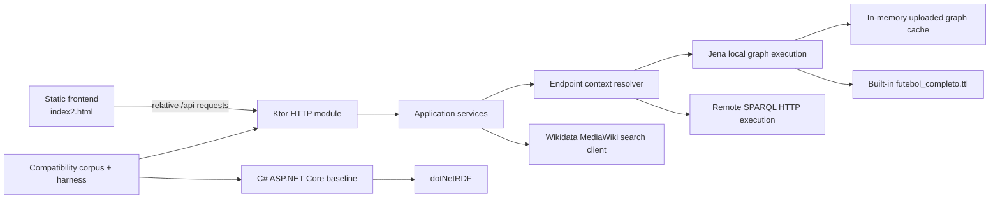
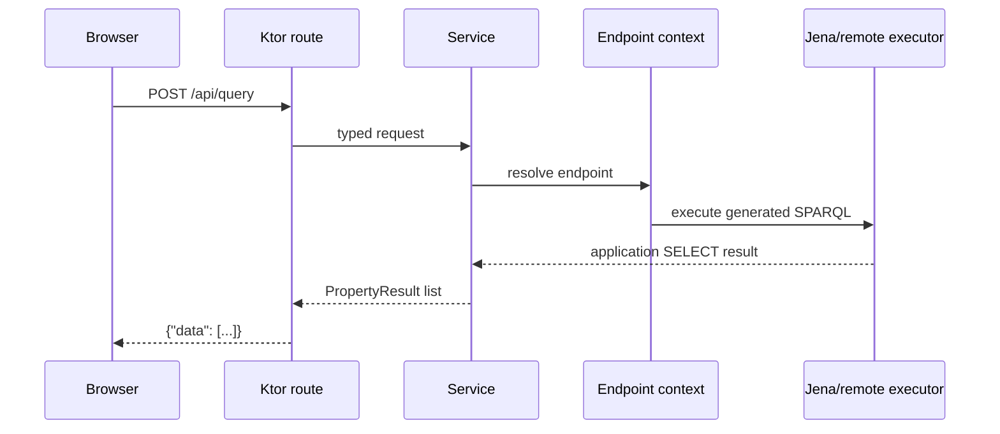

# System Architecture

## Current architecture

## Backend boundaries

**Confirmed:** Kotlin domain types own RDF values, graph statements, SELECT rows, bound bindings, and unbound bindings. Jena imports are confined to `rdf/jena`; services operate on application-owned interfaces.

**Confirmed:** Endpoint selection is request-scoped and distinguishes built-in graph, uploaded graph, Wikidata, and generic remote SPARQL endpoints.

**Potential issue:** Generic remote HTTP(S) endpoints are caller-controlled, which remains an SSRF/open-proxy risk until a production endpoint policy is approved.

## Original versus migrated request flow

## Source files

- `src/main/kotlin/com/example/sparqlqueryeasy/domain/model/DomainModels.kt`
- `src/main/kotlin/com/example/sparqlqueryeasy/application/endpoints/EndpointContextResolver.kt`
- `src/main/kotlin/com/example/sparqlqueryeasy/rdf/jena/JenaRdfInfrastructure.kt`
- `Sparql.QueryEasy/Services/EndpointService.cs`
