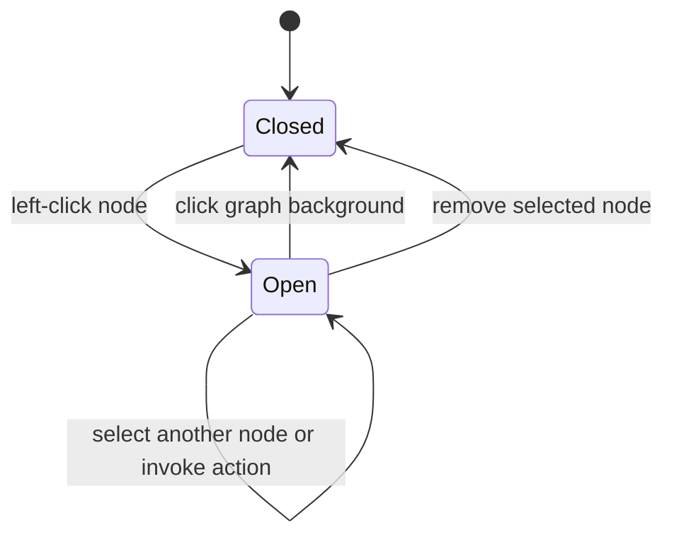
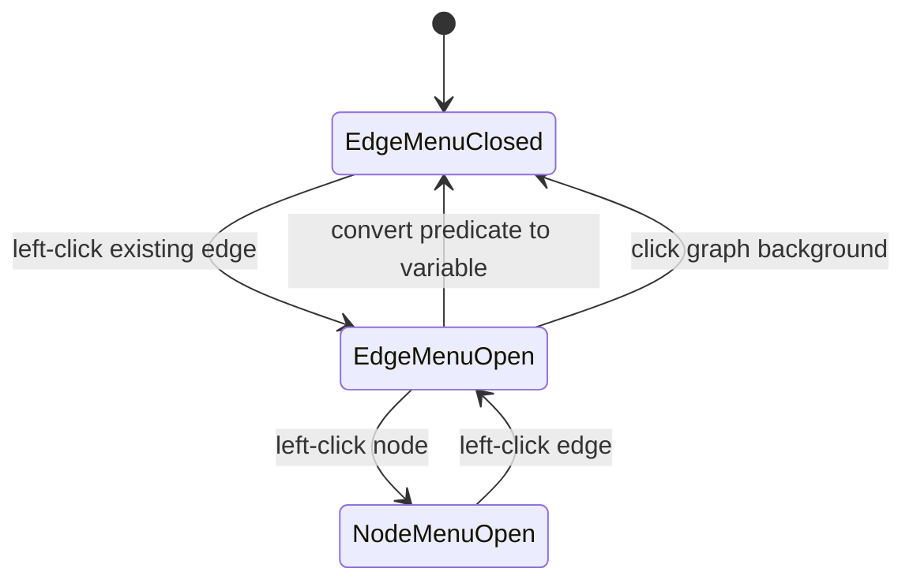
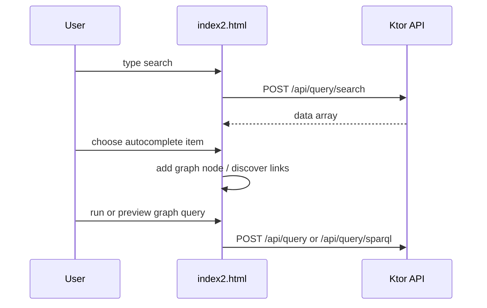

# Frontend Architecture

## Pages and assets

| Status | File | Responsibility |
|---|---|---|
| Confirmed | `sparql/index2.html` | Main graph-query UI and current client contract. |
| Confirmed prototype | `sparql/login.html` | Packaged static form, but it posts to removed `index.html`; approved authentication awaits `AUTH-000`/`AUTH-001`/`AUTH-002`. |
| Confirmed | `sparql/grafos.css` | Graph-related styling. |
| Confirmed | `sparql/cytoscape.min.js` | Local graph rendering library. |
| Confirmed | `sparql/cytoscape-cxtmenu.js` | Retained local plugin asset; the authoritative page no longer loads it. |

## State and interaction

**Confirmed:** Browser state is maintained in JavaScript variables such as `cy` (Cytoscape graph), `searches` (autocomplete result map), and `trData` (selected result metadata). There is no frontend router or separate state-management framework.

**Confirmed:** A left click selects a node and opens one page-owned vertical
action list beside it. Selecting another node retargets the same list; a graph-
background click closes it. Entity, variable, default, link, Boolean, and
literal behavior is invoked through explicit list buttons. Remove closes the
list because the selected node ceases to exist; node replacement retargets it.
The former circular right-click/long-press plugin is not loaded by
`index2.html`.

**Confirmed:** A left click on an existing graph edge opens a separate,
accessible action list. Its current action changes only the edge predicate
representation: `nodeId` becomes a collision-safe SPARQL variable named
`?predicate_<number>`, the visible edge label becomes `?`, and its type becomes
`variable`. The Cytoscape edge ID, source, target, and unrelated edge metadata
are retained. Selecting an edge closes the node list, so edge selection cannot
invoke a node action. A graph-background click closes either list.

## API integration

**Confirmed:** `API_BASE` is empty and API URLs are relative, supporting same-origin Ktor development at `http://localhost:8080` without CORS.

**Confirmed:** The frontend calls all API routes documented in [[03 - Backend/API v1]]. Turtle uploads send `ttlFile`; on success the returned UUID replaces the endpoint input. Payload mapping, UI response consumption, failure behavior, and test boundaries are in [[Request Flows]].

**Approved feature direction:** [[Predicate Variable Edge Contract]] defines
the planned user-visible conversion of an edge predicate into a projected
SPARQL variable. Kotlin already accepts such predicates; `FE-003` exposes the
capability through the graph interface.

**Approved direction with open product choices:** [[Two Variable Exploration
Contract]] records staged exploration for exactly two variables. `FE-004`
implements only its no-request panel foundation; `DEC-008` gates live
candidate/binding work.

**Potential issue:** Materialize, Intro.js, Google icons, and CSS are loaded from third-party CDNs, so local development is not fully offline.

## Planned authentication boundary

**Decision required:** Login implementation is approved, but no credential,
session, anonymous-access, route-protection, CSRF, registration, or recovery
contract exists yet. `AUTH-000` is the human gate; backend and frontend work
must not invent those behaviors. Current links and form submission are not a
working or secure authentication flow.

**Confirmed:** Playwright browser tests validate search-result-to-node
insertion, Turtle upload endpoint replacement, relationship expansion, SPARQL
preview/query execution, node-menu opening/retargeting/persistence/dismissal,
node-type actions, conversion/removal, and viewport positioning against test-
local HTTP responses. They also validate edge-menu isolation, predicate-variable
conversion, topology/metadata preservation, and the generated query request
body. They serve the actual page, use controlled CDN stubs, and assert relative
API URLs. Run `npm run test:browser`; see [[Request Flows]].

## Source files

- `sparql/index2.html`
- `sparql/login.html`
- `sparql/grafos.css`
- `frontend-tests/index2.spec.mjs`
- `frontend-tests/cdn-stubs.mjs`
- `src/main/kotlin/com/example/sparqlqueryeasy/http/HttpModule.kt`
