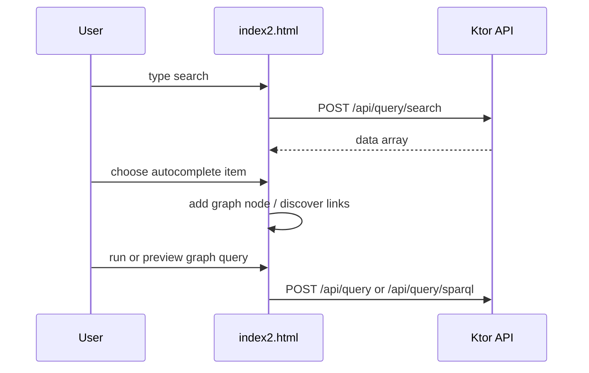

# Frontend Architecture

## Pages and assets

| Status | File | Responsibility |
|---|---|---|
| Confirmed | `sparql/index2.html` | Main graph-query UI and current client contract. |
| Unverified | `sparql/login.html` | Exists, but no supporting backend authentication route was found. |
| Confirmed | `sparql/grafos.css` | Graph-related styling. |
| Confirmed | `sparql/cytoscape.min.js` | Local graph rendering library. |
| Confirmed | `sparql/cytoscape-cxtmenu.js` | Local Cytoscape context-menu plugin. |

## State and interaction

**Confirmed:** Browser state is maintained in JavaScript variables such as `cy` (Cytoscape graph), `searches` (autocomplete result map), and `trData` (selected result metadata). There is no frontend router or separate state-management framework.

## API integration

**Confirmed:** `API_BASE` is empty and API URLs are relative, supporting same-origin Ktor development at `http://localhost:8080` without CORS.

**Confirmed:** The frontend calls all API routes documented in [[03 - Backend/API v1]]. Turtle uploads send `ttlFile`; on success the returned UUID replaces the endpoint input. Payload mapping, UI response consumption, failure behavior, and test boundaries are in [[Request Flows]].

**Potential issue:** Materialize, Intro.js, Google icons, and CSS are loaded from third-party CDNs, so local development is not fully offline.

**Confirmed:** Playwright browser tests now validate search-result-to-node
insertion, Turtle upload endpoint replacement, relationship expansion, and
SPARQL preview/query execution against test-local HTTP responses. They serve
the actual page, stub only CDN scripts, and assert relative API URLs. Run
`npm run test:browser`; see [[Request Flows]].

## Source files

- `sparql/index2.html`
- `sparql/login.html`
- `sparql/grafos.css`
- `src/main/kotlin/com/example/sparqlqueryeasy/http/HttpModule.kt`
