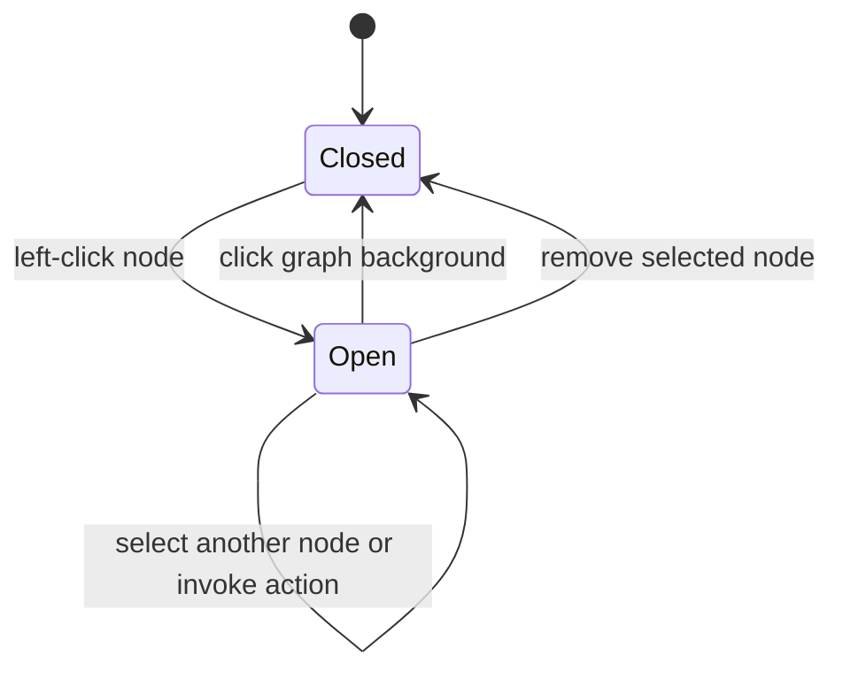
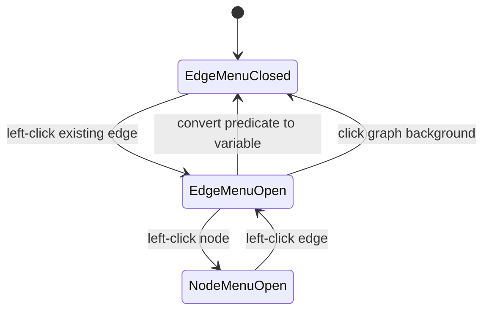
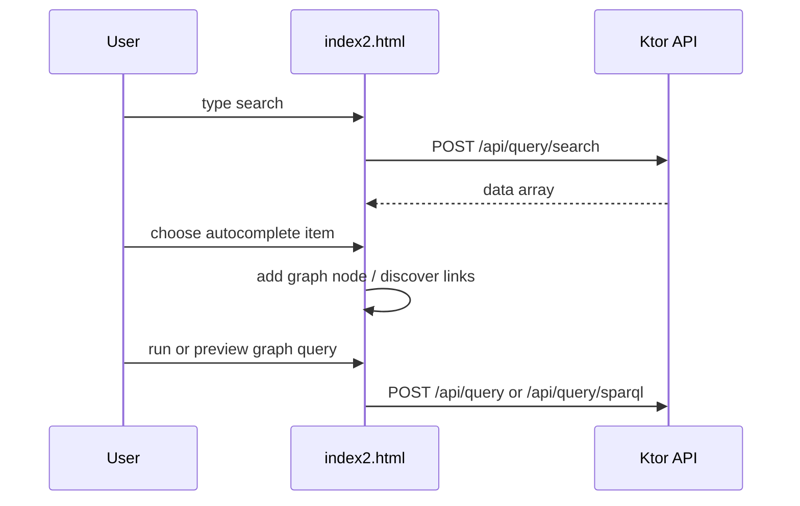

# Frontend Architecture

## Pages and assets

| Status | File | Responsibility |
|---|---|---|
| Confirmed | `sparql/index2.html` | Main graph-query UI and current client contract. |
| Confirmed prototype | `sparql/login.html` | Packaged static form, but it posts to removed `index.html`; approved authentication awaits `AUTH-000`/`AUTH-001`/`AUTH-002`. |
| Confirmed | `sparql/grafos.css` | Graph-related styling. |
| Confirmed | `sparql/index2.css` | Page layout, menus, panels, modals and toolbar styles for `index2.html`; loaded last. |
| Confirmed | `sparql/app-core.js` | Classic script: config, shared state (`cy`, `searches`, `trData`), utilities, modals, API calls, `runQuery` and graph operations. |
| Confirmed | `sparql/stage-order.js` | Classic script: ordered variable registry bridge, stage-order blocks and the exploration panel. |
| Confirmed | `sparql/stage-exploration.js` | Classic script: staged exploration requests/state and the possible-graph window. |
| Confirmed | `sparql/graph-nodes.js` | Classic script: node factory, connection discovery, intro hint and change-value modal. |
| Confirmed | `sparql/graph-menus.js` | Classic script: `initGraphMenus()` owns node/edge action menus, connection preview, Alt+drag and their Cytoscape listeners; returns a small API to the bootstrap. |
| Confirmed | `sparql/graph-actions.js` | DOM-free node/edge action lists and predicate-variable naming; checked with JSDoc/TypeScript. |
| Confirmed | `sparql/query-calculations.js` | DOM-free query filter and variable calculations; checked with JSDoc/TypeScript. |
| Confirmed | `sparql/query-stages.js` | DOM-free ordered-exploration state: variable registry, query signature, block moves and the possible-graph assignments/caption; checked with JSDoc/TypeScript. |
| Confirmed | `sparql/cytoscape.min.js` | Local graph rendering library. |
| Confirmed | `sparql/cytoscape-cxtmenu.js` | Retained local plugin asset; the authoritative page no longer loads it. |

## State and interaction

**Confirmed:** `index2.html` loads the five classic scripts in order after the pure modules' bridge and before its inline `DOMContentLoaded` bootstrap, which creates `cy` and then calls `initGraphMenus()` once. Top-level functions remain globals for inline `onclick` handlers and tests.

**Confirmed:** Browser state is maintained in JavaScript variables such as `cy` (Cytoscape graph), `searches` (autocomplete result map), and `trData` (selected result metadata). There is no frontend router or separate state-management framework.

**Confirmed:** A left click selects a node and opens one page-owned vertical
action list beside it. Selecting another node retargets the same list; a graph-
background click closes it. Entity, variable, default, link, Boolean, and
literal behavior is invoked through explicit list buttons. Remove closes the
list because the selected node ceases to exist; node replacement retargets it.
The former circular right-click/long-press plugin is not loaded by
`index2.html`.

**Confirmed:** A left click on an existing graph edge opens a separate,
accessible action list. Its current action changes only the edge predicate
representation: `nodeId` becomes a collision-safe SPARQL variable named
`?predicate_<number>`, the visible edge label becomes `?`, and its type becomes
`variable`. The Cytoscape edge ID, source, target, and unrelated edge metadata
are retained. Selecting an edge closes the node list, so edge selection cannot
invoke a node action. A graph-background click closes either list.

**Confirmed:** Predicate-query result rows use an edge-specific selection
handler. It binds the captured edge IDs to the chosen predicate identifier and
label and clears the variable type in place. It preserves node/edge counts,
topology, and unrelated metadata, and ignores removed or rebound edges.
Ordinary node-query results continue to use node replacement.

**Confirmed:** Every node action list offers two outgoing connection actions.
The variable action assigns a collision-safe `?predicate_<number>` value. The
defined action calls `/api/query/relationships` for the selected source node
and displays the returned predicate labels in the action list. After either
choice, a dashed arrow follows the pointer from the source node. Clicking an
existing destination node creates the graph edge; Escape or a graph-background
click cancels the preview without adding an edge. The new edge has `nodeId`
set to the chosen predicate, so `buildFilters()` includes it in the existing
query request. No new graph node or backend route is created for this flow.

**Confirmed:** Before staging or executing the first component, Run Query
rejects multiple distinct predicate variables on the same directed pair of
fixed RDF endpoints. Those parallel edges do not form a traversal chain.
Two variables on successive edges still stage; parallel edges sharing a single
variable still execute as one binding. See [[Two Variable Exploration Contract]].

## API integration

**Confirmed:** `API_BASE` is empty and API URLs are relative, supporting same-origin Ktor development at `http://localhost:8080` without CORS.

**Confirmed:** The frontend calls all API routes documented in [[03 - Backend/API v1]]. Turtle uploads send `ttlFile`; on success the returned UUID replaces the endpoint input. Payload mapping, UI response consumption, failure behavior, and test boundaries are in [[Request Flows]].

**Approved feature direction:** [[Predicate Variable Edge Contract]] defines
the planned user-visible conversion of an edge predicate into a projected
SPARQL variable. Kotlin already accepts such predicates; `FE-003` exposes the
capability through the graph interface.

**Approved direction:** [[Two Variable Exploration Contract]] records
ordered staged exploration for two or more variables (DEC-008). `FE-004`
added the no-request panel. `FE-008` added the session-only variable
registry in `index2.html` (`refreshVariableOrder`, `getVariableOrder`,
`setVariableOrder`): one entry per distinct variable of the first component,
sorted initially, reset when the exploration signature (endpoint plus element
IDs, values, endpoints, predicates and filter types; not labels or positions)
changes. Cytoscape `add`/`remove`/`data` events, endpoint input/change and
Turtle upload schedule a refresh. `FE-009` renders that order as numbered
blocks in `#variable-order` beside Run Query (`renderVariableOrder`,
`moveVariableBlock`, pointer drag in `initVariableOrderDrag`). Two or more
variables open the panel with that order. The panel runs one exploration
(`startExploration`): one current stage request, a shared page cache, the
`createPreviewScheduler` preview budget, commitments with Back, and a final
**Apply to graph** (`applyExplorationToGraph`), the only step that edits
Cytoscape.

**Confirmed (FE-014):** mouse-wheel zoom uses Cytoscape
`wheelSensitivity: 0.2` (about 1.2× per notch, near the 1.25× zoom buttons);
Cytoscape logs an expected one-time warning for the non-default value.

**Potential issue:** Materialize, Intro.js, Google icons, and CSS are loaded from third-party CDNs, so local development is not fully offline.

## Planned authentication boundary

**Decision required:** Login implementation is approved, but no credential,
session, anonymous-access, route-protection, CSRF, registration, or recovery
contract exists yet. `AUTH-000` is the human gate; backend and frontend work
must not invent those behaviors. Current links and form submission are not a
working or secure authentication flow.

**Confirmed:** Playwright browser tests validate search-result-to-node
insertion, Turtle upload endpoint replacement, relationship expansion, SPARQL
preview/query execution, node-menu opening/retargeting/persistence/dismissal,
node-type actions, conversion/removal, and viewport positioning against test-
local HTTP responses. They also validate edge-menu isolation, predicate-variable
conversion, topology/metadata preservation, and the generated query request
body. They serve the actual page, use controlled CDN stubs, and assert relative
API URLs. Run `npm run test:browser`; see [[Request Flows]].

## Source files

- `sparql/index2.html`
- `sparql/login.html`
- `sparql/grafos.css`
- `frontend-tests/index2.spec.mjs`
- `frontend-tests/cdn-stubs.mjs`
- `src/main/kotlin/com/example/sparqlqueryeasy/http/HttpModule.kt`
