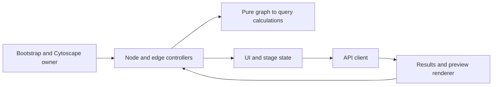

# Frontend Evolution Audit

DEV-001, 2026-09-28. Analysis only: no application code, dependency or bundler
was changed. Recommendation is proposed; follow-up cards remain BACKLOG.

## Evidence and concentration

Confirmed: `sparql/index2.html` is 2,221 lines. Inline application JavaScript
starts at line 629; DOMContentLoaded initialization starts at 1337. The file
combines styles, markup, filters, API calls, result application and graph/menu
listeners. Line count describes concentration, not a performance measurement.
Globals include `cy`, `searches`, `trData` and the menu controller. Inline HTML
handlers and browser tests call functions such as `runQuery` via `window`.

Confirmed: jQuery 2.1.1 is loaded and `$.ajax` is used for query, relationship,
upload and search requests. Materialize, Intro.js and cytoscape-html-label are
external scripts; Cytoscape is local. External Materialize/Intro CSS and Google
icon fonts remain. Playwright stubs the external JavaScript but has no general
external-request failure guard. This confirms the previously noted offline
limitation by source inspection; no new browser run was made for this audit.

Confirmed: `build.gradle.kts` copies six named frontend files into classpath
`frontend`; Ktor serves that directory via `staticResources`. The test server
serves source files and synthetic API responses independently of Ktor. There
is no configured application bundler, type checker or pure-JS unit-test script.

## Four evaluation scenarios

| Scenario | Concrete change pressure |
|---|---|
| FE-009 numbered reorder menu | Stable variable identity/order should be calculated independently of drawing and event handlers |
| FE-006 hover candidate preview | Query signature, temporary binding, request cancellation and stale-response rejection need explicit state ownership |
| Fixed predicate-result bug | `getQuery` must choose edge binding, not node replacement; tests assert unchanged topology/metadata |
| Fixed parallel-predicate bug | `hasParallelPredicateVariables` must reject parallel alternatives without mistaking them for a chain; tests assert no API call |

The last two are historical fixes in current code, not newly observed failures.
Current multi-variable support remains a foundation: exactly two opens the
panel without requests; larger counts fall through legacy projection choice.
Do not convert this finding into a behavior change during extraction.

## Options (qualitative estimates, not benchmarks)

| Criterion | A: small native JS modules, existing UI | B: modules plus TypeScript/JSDoc checking and optional Vite | C: component-framework rewrite |
|---|---|---|---|
| Initial scope | Extract query calculations, bridge current globals, package new files | A plus compiler/config/types and build artifact integration if Vite chosen | Rework toolbar/menus/state/lifecycle and much browser initialization |
| Context per task | Query or menu module plus entry adapter | Similar modules with explicit type contracts | Components plus graph adapter, store and build system |
| Locality | Good if responsibilities, not arbitrary line chunks, define modules | Better checks at module boundaries | UI locality possible; graph still needs an adapter |
| Pure tests | Node can exercise detached graph-data calculations | Same, plus static checking | Domain must still be extracted separately |
| Bug prevention | Identity/state invariants tested explicitly | Can detect type mismatches; runtime races still need tests | Component lifecycle helps ownership only if used correctly; not a race guarantee |
| Cytoscape ownership | One bootstrap owns `cy`; controllers attach/detach named listeners | Same owner with typed boundary | Framework owns UI DOM; dedicated canvas adapter owns Cytoscape, not both |
| API alignment | Contract fixtures checked against DTO/route tests | Types help locally; still need DTO/OpenAPI boundary checks | Same contract work remains |
| Ktor/offline operation | Add JS resources to Gradle; keep same-origin static serving | If bundled, copy generated assets and resolve manifest; localize dependencies separately | Requires new artifact/asset integration and dependency policy |
| Thesis schedule | Lowest estimated transition cost for FE-008/009 | Useful after extraction if type errors or asset complexity justify it | Highest estimated transition cost without evidence current features need it |

Finalists are A and incremental B. Native modules require correct JS MIME
types and do not automatically export names onto `window`; retain a narrow
bridge for current handlers while extracting. See [MDN modules](https://developer.mozilla.org/en-US/docs/Web/JavaScript/Guide/Modules).
TypeScript can check existing JavaScript with `checkJs`/JSDoc, allowing a
limited pilot without converting all files. See [TypeScript JavaScript checking](https://www.typescriptlang.org/docs/handbook/type-checking-javascript-files.html).
Vite's backend integration uses build artifacts/manifest and a distinct dev
entry; adopting it would require deliberate Gradle/Ktor packaging changes.
See [Vite backend integration](https://vite.dev/guide/backend-integration).
These docs establish mechanisms, not tested compatibility with this project;
no new dependency version is selected or installed. C is not a finalist because
the four scenarios do not demonstrate a need to replace the rendering stack.

## Recommended boundaries and first delivery

Proposed direction: A first; consider a small B type-checking pilot later.
Keep the present graph owner and UI, extract pure query/variable calculations,
then isolate the asynchronous preview controller as part of FE-006. Do not
replace jQuery merely because it implements Ajax.

The bootstrap owns `cy` and registers/disposes controllers once. Pure query
code receives graph data, never DOM references. Controllers own menu focus
and attach/detach their named listeners. Transport accepts query signature
and cancellation; stage state rejects responses whose signature is obsolete.
The renderer displays results, while explicit actions apply accepted changes
to the graph. B would retain these boundaries with checked types. C would
replace UI ownership but still need this Cytoscape and asynchronous boundary.

First cards: QUAL-003 closes browser egress; FE-011 extracts only query data
calculations for FE-008/009; FE-012 evaluates a narrow JS type-checking pilot.
Each has an independent oracle and local commit. Acceptance for the extraction
is identical query payloads and graph behavior, pure calculation tests, browser
gate and packaged-resource smoke. Rollback is reverting the extraction commit,
retaining untouched captures and tests. No wholesale framework migration is
authorized. DEC-008 still decides staged-query product behavior.

## Source files

- `sparql/index2.html`: `buildFilters`, `extractVariableName`, `runQuery`,
  `getQuery`, `replacePredicateVariable`, `hasParallelPredicateVariables`,
  DOMContentLoaded, `predicateChoiceRequestId`, Cytoscape listeners.
- `frontend-tests/index2.spec.mjs`, `frontend-tests/cdn-stubs.mjs`,
  `frontend-tests/server.mjs`, `playwright.config.mjs`, `package.json`.
- `build.gradle.kts`; `src/main/kotlin/com/example/sparqlqueryeasy/http/HttpModule.kt`.
- `tcc/90 - Tasks/items/FE-006-second-variable-assumption-and-preview.md`;
  `tcc/90 - Tasks/items/FE-009-reorderable-query-block-menu.md`.
