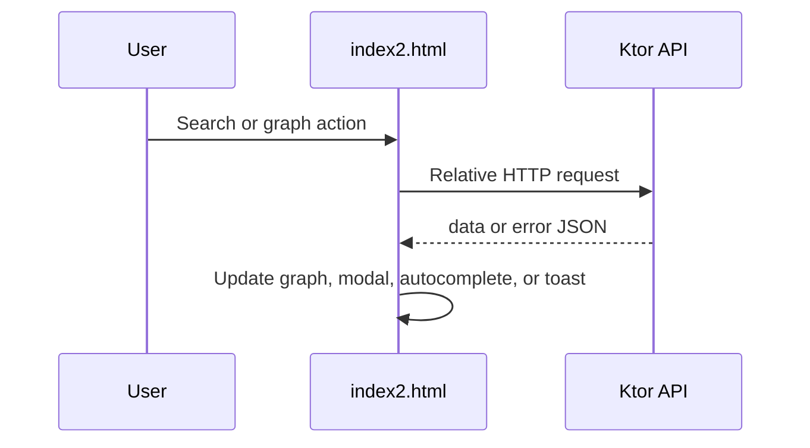

# Frontend-to-Backend Request Flows

**Scope:** The authoritative static client is `sparql/index2.html`, served by
Ktor. `API_BASE` is empty, so every request below is same-origin during local
development at `http://localhost:8080`.

## Request-flow matrix

| Frontend trigger/function | Request and payload mapping | Response consumption | Failure presentation | Contract and automated coverage |
|---|---|---|---|---|
| Page initialization | `GET /health` through `$.get` | Logs a warm-up success only | Console warning: `API warmup failed (offline?)` | [[03 - Backend/API v1#GET /health\|API v1]]; `ApplicationTest`; `StaticFrontendRoutesTest` |
| Turtle file chooser | `POST /api/local-database`, multipart `ttlFile` from selected file | Assigns `response.data` to `#input-endpoint-sparql`; success toast | Loading overlay ends; toast includes raw `err.responseText` or `Unknown error` | [[03 - Backend/API v1#POST /api/local-database\|API v1]]; `LocalDatabaseRoutesTest`; `StaticFrontendRoutesTest` |
| Search field after 400 ms debounce | `POST /api/query/search`: `endpointUrl: getEndpoint()`, trimmed `search`, `limit: getLimit()` | Builds Materialize autocomplete labels and stores each full item in `searches` | Console error only | [[03 - Backend/API v1#POST /api/query/search\|API v1]]; `QueryRoutesTest`; `StaticFrontendRoutesTest` |
| Select autocomplete item | Zero or more `POST /api/query` connection probes: graph IDs and `?predicate`, `limit: 1`, `ignoreWikidata: false` | If a probe returns data, adds a graph relationship; otherwise adds standalone node | Console error; probe resolves `false` | [[03 - Backend/API v1#POST /api/query\|API v1]]; `QueryRoutesTest`; `StaticFrontendRoutesTest`; browser interaction coverage is deferred to `FE-001` |
| Node action list: Explore relationships | A left-click selects an entity node; the explicit list action sends `POST /api/query/relationships` with `endpointUrl` and selected node `id` | The list remains selected while `trData` is filled, the relationship table is rendered, and the result modal opens | Loading overlay ends; generic failure toast and console error; the action list remains associated with the node | [[03 - Backend/API v1#POST /api/query/relationships\|API v1]]; `QueryRoutesTest`; `StaticFrontendRoutesTest`; `frontend-tests/index2.spec.mjs` |
| Edge action list: Convert relation to variable | A left-click on an existing edge performs no HTTP request. The explicit action changes the predicate held in its `nodeId` to a collision-safe `?predicate_<number>` variable and shows `?`; source, target, edge ID, and other data stay unchanged. | The next query uses the changed predicate as part of `where`; when there is no variable node, that predicate variable becomes `variableName`. | No HTTP failure path exists for conversion. The menu closes after conversion; a background click also dismisses the list. | `frontend-tests/index2.spec.mjs`; browser coverage asserts the eventual `POST /api/query` JSON body. |
| Relationship table selection | `POST /api/query/relationship-value`: `endpointUrl`, cached `subjectId`, `predicateId`, `isLiteral` | One value creates node/edge; zero or many creates a `many-results` placeholder | Loading overlay ends; generic failure toast and console error | [[03 - Backend/API v1#POST /api/query/relationship-value\|API v1]]; `QueryRoutesTest`; `StaticFrontendRoutesTest` |
| Variable-node action list: Run query | The explicit action sends `POST /api/query`: `endpointUrl`, graph-derived `where`, selected `variableName`, `limit` | Fills `trData`, renders a result table, then selection replaces/adds graph nodes; replacement retargets the persistent action list | Loading overlay ends; generic `Query failed` toast and console error | [[03 - Backend/API v1#POST /api/query\|API v1]]; `QueryRoutesTest`; `StaticFrontendRoutesTest`; `frontend-tests/index2.spec.mjs` |
| SPARQL preview | `POST /api/query/sparql`: `endpointUrl`, graph-derived `where`, `variableName`, `limit` | Writes `data.data` using `.text()` and opens SPARQL modal | Loading overlay ends; substitutes generic modal text, logs error, opens modal | [[03 - Backend/API v1#POST /api/query/sparql\|API v1]]; `QueryRoutesTest`; `StaticFrontendRoutesTest` |

`getEndpoint()` trims the endpoint input. `getLimit()` accepts a positive
integer and otherwise sends `20`. `buildFilters()` maps graph edges to
`{subject, predicate, object, filterType}`; it preserves numeric `filterType:
0`, the valid “Starts with” value.

## Node action-list flow

**Confirmed:** Node and edge selection themselves send no request and perform
no node-type operation. A node opens its semantic vertical list beside the node;
an edge opens a separate list beside its rendered midpoint. Selecting one closes
the other, so an edge cannot run a node action. Node actions then invoke the
same functions used by the earlier direct-tap behavior:
relationship exploration, variable/default query execution, safe link opening,
Boolean toggling, literal editing, conversion, and removal. The list is
retargeted when an action replaces the selected node. A true Cytoscape
background click is the normal dismissal path; Remove also closes it because
there is no longer a target. Pan, zoom, resize, layout, and node-position events
reposition the lists, which become visually hidden while their target is outside
the graph viewport.

## Confirmed error-behavior gap

**Confirmed:** Most client request callbacks discard the approved Kotlin JSON
`error` field and show generic English text or merely log the failure. Turtle
upload is the exception: it displays raw `responseText`. This preserves the
current behavior, but means client users usually cannot see the diagnostic
documented in [[03 - Backend/API v1]]. Whether to render parsed, safe error
diagnostics consistently is a future UX decision; this task makes no contract
or UI change.

## Coverage boundary

`StaticFrontendRoutesTest` confirms Ktor serves the authoritative client and
that its source declares each backend route, same-origin base, and `ttlFile`
form field. `ApplicationTest`, `LocalDatabaseRoutesTest`, and
`QueryRoutesTest` exercise the corresponding HTTP contracts without live
Wikidata. `frontend-tests/index2.spec.mjs` now runs the actual page in
Playwright Firefox with test-local API responses and controlled CDN stubs. It
catches a broken autocomplete callback and verifies upload, relationship,
SPARQL-preview, query-execution, real left-click node-menu opening, retargeting,
keyboard action activation, background dismissal, the node-type action matrix,
conversion/removal, edge rewiring, viewport positioning, edge-menu isolation,
predicate-variable conversion, and the exact `POST /api/query` predicate-query
payload.

## Source files

- `sparql/index2.html`
- `frontend-tests/index2.spec.mjs`
- `frontend-tests/cdn-stubs.mjs`
- `src/test/kotlin/com/example/sparqlqueryeasy/http/StaticFrontendRoutesTest.kt`
- `src/test/kotlin/com/example/sparqlqueryeasy/http/QueryRoutesTest.kt`
- `src/test/kotlin/com/example/sparqlqueryeasy/http/LocalDatabaseRoutesTest.kt`
- `src/test/kotlin/com/example/sparqlqueryeasy/ApplicationTest.kt`
- [[03 - Backend/API v1]]
