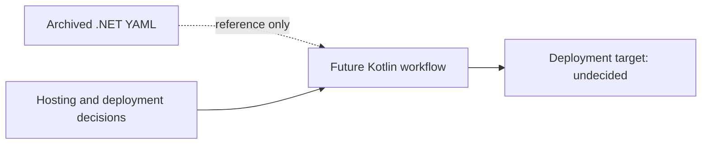

# Archived .NET Deployment Workflow

## Current status

**Confirmed:** The legacy ASP.NET deployment configuration is retained at
`.github/archived-workflows/master_sparql-query-easy.yml`. It was moved out of
`.github/workflows/` during Kotlin migration, so the integrated tree contains no active
GitHub Actions workflow. GitHub Actions discovers repository workflows from
`.github/workflows/`, not the archive directory.

**Important boundary:** The legacy YAML is preserved only in the archive,
not under the active workflow directory of the integrated `main` tree. The user reports that GitHub
Actions shows no runnable workflow for this fork. The file's presence alone
does not prove an enabled workflow; remote execution state was not independently
queried. No remote workflow setting, Azure app, deployment, or credential was
changed by this repository edit. The archive is reference material, not a
Kotlin deployment template.

## Preserved configuration

The archived YAML retains the original jobs and settings, with only an archive
notice added above the existing comments:

- Triggers: pushes to `master` and manual `workflow_dispatch`.
- Build: `windows-latest`, .NET 8.x setup, `dotnet build` and `dotnet publish`.
- Artifact transfer: upload/download of `.net-app` between jobs.
- Deployment: Azure Web App `sparql-query-easy`, Production slot/environment,
  using a GitHub publish-profile secret reference. The secret value is not in
  the archive or this note.

This describes the **old** C# deployment path, not a selected future target.
When hosting, domain, security and release strategy are decided under
OPS-002–OPS-004, design a Kotlin workflow from scratch. Do not reactivate the
archived .NET workflow as a shortcut.

## Source files

- `.github/archived-workflows/master_sparql-query-easy.yml`
- `tcc/90 - Tasks/items/MIG-002-retire-csharp-project.md`
- `tcc/90 - Tasks/items/OPS-002-dns-tls-cors.md`
- `tcc/90 - Tasks/items/OPS-003-aws-deployment-plan.md`
