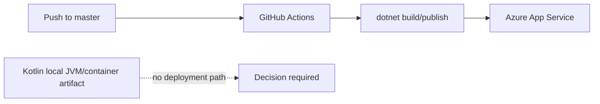

# Operations Inventory

## Deployment artifacts

**Confirmed:** The only CI/CD artifact is a GitHub Actions workflow that builds/publishes the .NET application on Windows and deploys it to Azure App Service `sparql-query-easy` using a GitHub secret.

**Confirmed:** `Dockerfile` and `.dockerignore` define a local-only Kotlin
container build. See [[Local JVM and Container Runtime]]. No image is deployed.

**Confirmed absent from the repository:** Compose file, Kubernetes manifests, Terraform, AWS configuration, reverse-proxy configuration, DNS records, TLS configuration, backup configuration, and Kotlin deployment workflow.

## CORS and TLS

**Intended:** Local development serves static frontend and API same-origin on port 8080. Production CORS is deferred until a frontend domain is selected.

**Decision required:** Select hosting platform, domain(s), TLS termination, reverse proxy, allowed origins, health checks, and rollback strategy before production deployment.

## Source files

- `.github/workflows/master_sparql-query-easy.yml`
- `Sparql.QueryEasy/Program.cs`
- `MIGRATION.md`
- `Dockerfile`
- `.dockerignore`
