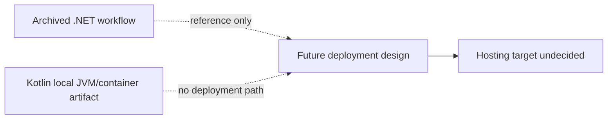

# Operations Inventory

## Deployment artifacts

**Confirmed:** The Kotlin branch has no active GitHub Actions workflow. The
former .NET/Windows/Azure deployment YAML is retained outside the active
workflow directory at `.github/archived-workflows/master_sparql-query-easy.yml`.
See [[Archived .NET Deployment Workflow]]. The default `master` branch still
tracks the old YAML until this change is integrated. The user reports no
enabled workflow in the fork's GitHub Actions UI; remote execution state was
not independently queried.

**Confirmed:** `Dockerfile` and `.dockerignore` define a local-only Kotlin
container build. See [[Local JVM and Container Runtime]]. No image is deployed.

**Confirmed absent from the repository:** Compose file, Kubernetes manifests, Terraform, AWS configuration, reverse-proxy configuration, DNS records, TLS configuration, backup configuration, and Kotlin deployment workflow.

## CORS and TLS

**Intended:** Local development serves static frontend and API same-origin on port 8080. Production CORS is deferred until a frontend domain is selected.

**Decision required:** Select hosting platform, domain(s), TLS termination, reverse proxy, allowed origins, health checks, and rollback strategy before production deployment.

## Source files

- `.github/archived-workflows/master_sparql-query-easy.yml`
- `Sparql.QueryEasy/Program.cs` (historical, Git commit `0f20091`)
- `MIGRATION.md`
- `Dockerfile`
- `.dockerignore`
