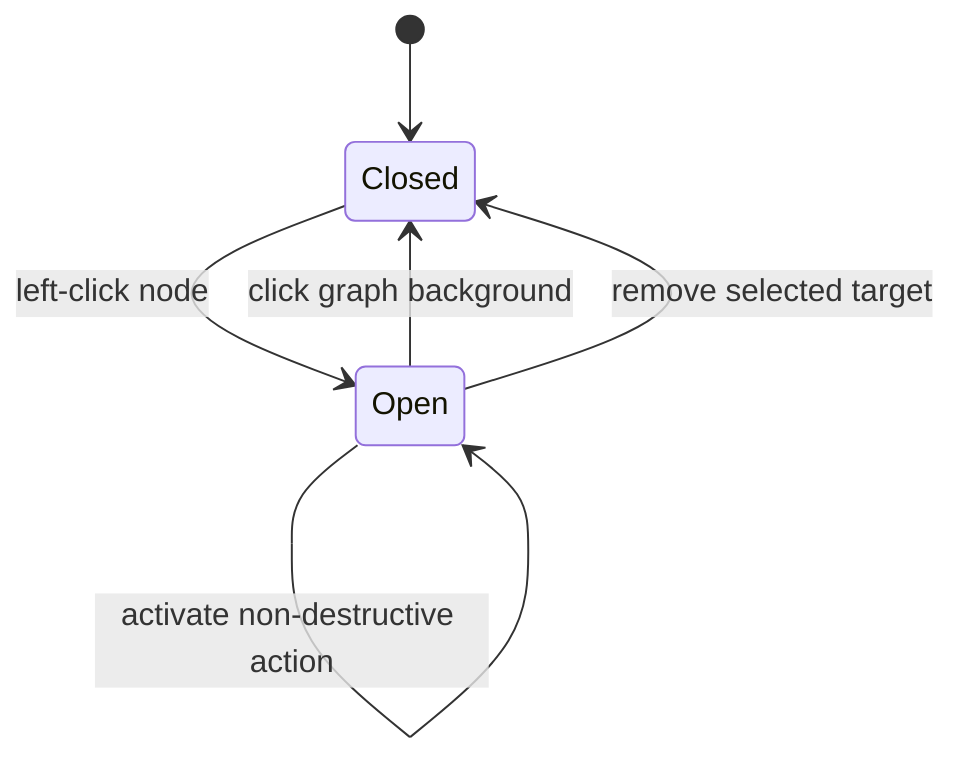

# Replace the node radial menu with a persistent left-click action list

## Objective

Replace the node menu that currently requires a right-click or long press and
renders circularly around a Cytoscape node. A normal left click must select the
node and open a vertical action list beside it. The list must remain visible
until the user clicks the graph background, except when its target is removed
and no anchor remains.

This is an explicitly requested frontend interaction change. It does not alter
the backend HTTP, RDF, or SPARQL contracts.

## Evidence and relevant files

### Confirmed current behavior

- `sparql/index2.html` initializes `cy.cxtmenu` for every node. Its three radial
  commands are Cancel, Remove, and Convert to variable.
- The bundled `sparql/cytoscape-cxtmenu.js` defaults to `cxttapstart taphold`
  and closes the radial menu on `cxttapend` or `tapend`; configuration alone
  cannot provide the requested persistent vertical list.
- A separate Cytoscape `tap` handler currently gives left click immediate,
  type-specific behavior: open links, explore entity relationships, query a
  default or variable node, toggle Boolean values, or open literal editing.
- A graph-background tap currently returns without changing UI state.
- `frontend-tests/index2.spec.mjs` exercises the authoritative page with
  Playwright and deterministic API responses, but does not cover the node
  action menu or background dismissal.
- `src/test/kotlin/com/example/sparqlqueryeasy/http/StaticFrontendRoutesTest.kt`
  verifies that Ktor serves the authoritative page and its declared API flows.

### Requested behavior

- A normal left click on a node opens the menu.
- The menu is a conventional vertical list positioned beside the selected
  node, not a circular menu surrounding it.
- The normal dismissal gesture is a click on the Cytoscape background. Clicking
  a node or a menu item must not dismiss the list merely because of the click.

## Interaction state flow



## Exact scope

1. Add page-owned HTML/CSS/JavaScript for one node-action list associated with
   the currently selected Cytoscape node.
2. Open or retarget the list from the existing node `tap` path. Position it
   beside the node and keep it within the visible graph container when the node
   is close to an edge.
3. Replace the radial menu presentation. Do not require right-click, press-and-
   hold, or a drag gesture to discover node actions.
4. Preserve all currently observable node actions by exposing them through the
   list rather than firing them merely because the node was selected:
   - entity node: explore relationships;
   - variable node: execute its component query;
   - default node: execute the current domain query;
   - link node: open its safe external link behavior;
   - Boolean/literal node: retain its current toggle/edit behavior;
   - applicable nodes: Remove and Convert to variable.
5. Remove the Cancel command because background click becomes the explicit
   dismissal operation. A destructive Remove action may close the list because
   its selected target no longer exists.
6. Keep the list open while its target remains valid when an action is invoked,
   including asynchronous success, empty, loading, and error paths. Modal
   presentation must not leave stale menu state or dispatch the underlying
   graph-background handler accidentally.
7. Reposition or safely hide/reopen the list when zooming, panning, laying out,
   replacing, or moving the selected node so it is never visually detached
   from the wrong node.
8. Render actions as semantic buttons in a labelled list. Support keyboard
   focus and activation without introducing a second, inconsistent action
   implementation.
9. Update the onboarding text and frontend documentation so they describe
   left-click selection, the side list, and background-only dismissal.
10. Extend deterministic Playwright coverage for the interaction; do not add
    live CDN, Wikidata, or backend dependencies.

## Explicitly out of scope

- Backend route, request, response, status-code, RDF, or SPARQL changes.
- Redesigning relationship/result modals or the rest of the graph toolbar.
- Changing the meaning of Remove, Convert to variable, query execution,
  relationship exploration, link opening, Boolean toggling, or literal editing.
- Editing the vendored `cytoscape-cxtmenu.js` bundle unless source inspection
  proves it is still required by another supported interaction.
- Adding authentication or production deployment behavior.

## Dependencies

- `FE-001` supplies the deterministic Playwright harness and is `DONE`.
- The current frontend contract and request flows are documented in
  [[04 - Frontend/Frontend Architecture]] and [[04 - Frontend/Request Flows]].

## Acceptance criteria

- [x] Left-clicking every supported node type opens one vertical action list
      adjacent to that node; no circular menu is displayed.
- [x] Selecting another node retargets and repositions the same list without
      briefly executing the old node's action.
- [x] Clicking the graph background closes the list.
- [x] Clicking the selected node, inside the list, or an enabled non-destructive
      action does not dismiss the list solely because of that click.
- [x] Removing the selected node removes its incident edges, updates the status
      bar, and closes the now-unanchored list.
- [x] Convert to variable preserves the node data/position and rewires edges as
      it does today, then keeps a correctly anchored list for the replacement.
- [x] Entity, variable, default, link, Boolean, and literal behaviors remain
      reachable and retain their existing API calls and observable effects.
- [x] Zoom, pan, layout, node movement, replacement, and viewport-edge cases do
      not leave a list attached to the wrong node or outside the graph viewport.
- [x] The list uses semantic, keyboard-operable controls with a programmatic
      label identifying the selected node.
- [x] Playwright tests cover opening, retargeting, action activation, persistence,
      background dismissal, Remove, Convert, and at least one API-backed node
      action using only test-local responses.
- [x] Existing browser tests and the Gradle quality gate pass unchanged.
- [x] Frontend architecture/request-flow documentation and `MIGRATION.md` record
      the approved interaction change and its verification evidence.

## Verification commands

```sh
npm run test:browser
GRADLE_USER_HOME=/tmp/sparql-query-easy-gradle ./gradlew ktlintCheck detekt test --no-daemon --console=plain
git diff --check
```

Manual verification at narrow and wide viewport sizes:

1. Add at least two node types to the graph.
2. Left-click each node and confirm the list retargets beside it.
3. Invoke a non-destructive action and confirm the list remains associated with
   the selected node.
4. Click the graph background and confirm the list closes.
5. Reopen it, pan/zoom or move the node, and confirm positioning remains valid.

## Expected documentation updates

- `tcc/04 - Frontend/Frontend Architecture.md`
- `tcc/04 - Frontend/Request Flows.md`
- `tcc/08 - Quality/Quality and Compatibility.md`
- `MIGRATION.md`
- this task, `tcc/90 - Tasks/TASKS.md`, and `tcc/90 - Tasks/RUN_LOG.md`

## Risks

- A node tap currently performs the node's primary action immediately. Opening
  a menu from the same event without moving that action into the list would
  cause both behaviors and could open a modal or issue a request unexpectedly.
- Cytoscape uses rendered graph coordinates while the list uses DOM/container
  coordinates; pan, zoom, resize, and layout can detach a naïve overlay.
- Boolean/literal edits replace nodes, while Convert changes node identity.
  Menu state must follow the valid replacement or close safely.
- Removing the vendored plugin before confirming all call sites could break a
  remaining touch or context-menu path.
- A persistent overlay can intercept canvas clicks; event propagation must
  distinguish menu interaction from a true graph-background click.

## Unresolved questions

- None required before implementation. The requested left-click, vertical-list,
  and background-dismiss behavior is treated as approved. If implementation
  reveals an action that cannot remain open because its target is replaced or
  removed, preserve a correct target association rather than displaying a
  stale menu.

## Execution log

- 2026-09-17: Set `FE-002` to `IN_PROGRESS` after confirming dependency
  `FE-001` is `DONE` and reviewing the dirty worktree to preserve unrelated
  changes.
- 2026-09-17: Created from the approved interaction request after inspecting
  the authoritative frontend, the cxtmenu bundle, existing Playwright tests,
  Ktor static-route tests, frontend documentation, and relevant Git history.
  No application behavior was changed.
- 2026-09-17: Used `find`, `sed`, `rg`, and `git log -p --follow` to read the
  applicable instructions and trace every current menu/tap call site. Verified
  the task frontmatter and index entry with `rg`; both Obsidian link targets
  exist. No repository Markdown/Mermaid checker was found, so the Mermaid state
  diagram was reviewed directly. `git diff --check` passed.
- Changed files for task creation:
  `tcc/90 - Tasks/items/FE-002-left-click-node-action-menu.md`,
  `tcc/90 - Tasks/TASKS.md`, and `tcc/90 - Tasks/RUN_LOG.md`.
- 2026-09-17: Replaced the page's `cy.cxtmenu` integration with a semantic,
  persistent vertical action list. Node selection now only opens/retargets the
  list; explicit buttons preserve entity, variable, default, link, Boolean,
  literal, Convert, and Remove behavior. Replacement operations retarget the
  list, background tap closes it, and viewport changes reposition or
  temporarily hide it when its target is off-screen.
- 2026-09-17: Expanded Playwright from three to eight deterministic tests. The
  first restricted run failed because the local server could not bind
  (`EPERM`). The first outside-sandbox interaction run exposed an empty HTML-
  label CDN stub that stopped initialization before Cytoscape handlers; a
  deterministic no-op extension stub fixed the harness. Subsequent failures
  were test positioning/scoping defects and were corrected without weakening
  behavior assertions. Final `npm run test:browser`: 8 passed.
- 2026-09-17: The first final Gradle attempt could not initialize its file-lock
  network service in the restricted sandbox. The approved outside-sandbox
  `GRADLE_USER_HOME=/tmp/sparql-query-easy-gradle ./gradlew ktlintCheck detekt
  test --no-daemon --console=plain` completed `BUILD SUCCESSFUL` (16 tasks).
  `git diff --check` passed. Obsidian link targets exist; Mermaid diagrams were
  reviewed directly because no repository Markdown/Mermaid checker is present.
- 2026-09-17: Updated `sparql/index2.html`, frontend/Ktor tests, frontend and
  quality notes, `MIGRATION.md`, and task indexes/logs. Every acceptance
  criterion has direct source or automated-test evidence; completed `FE-002`.

## Source files

- `sparql/index2.html`
- `sparql/cytoscape-cxtmenu.js`
- `sparql/grafos.css`
- `frontend-tests/index2.spec.mjs`
- `frontend-tests/server.mjs`
- `playwright.config.mjs`
- `package.json`
- `src/test/kotlin/com/example/sparqlqueryeasy/http/StaticFrontendRoutesTest.kt`
- `tcc/04 - Frontend/Frontend Architecture.md`
- `tcc/04 - Frontend/Request Flows.md`
